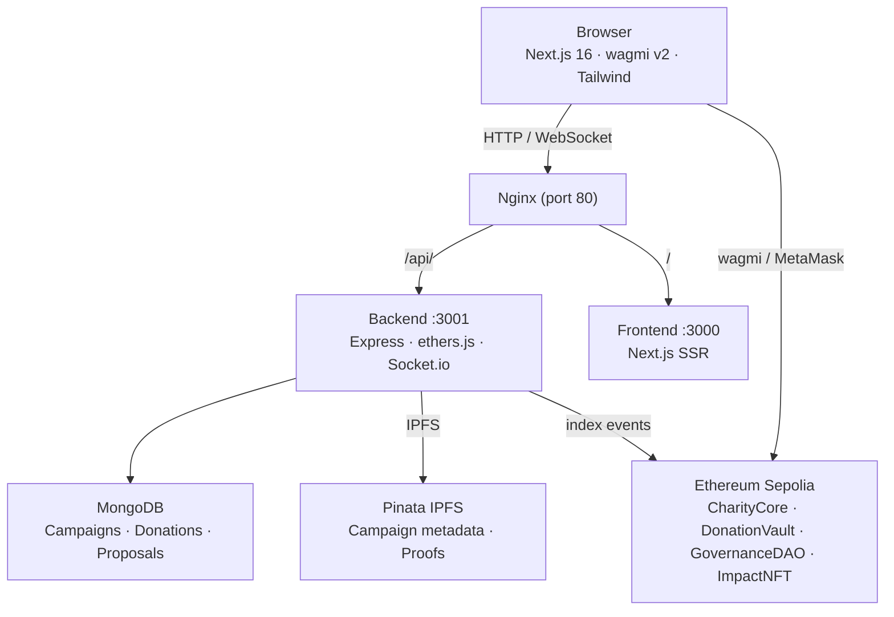

# TranspaChain Architecture Diagram

## System Architecture

```mermaid
graph TD
    Browser["Browser\nNext.js 16 · wagmi v2 · Tailwind"]
    Nginx["Nginx (port 80)"]
    Backend["Backend :3001\nExpress · ethers.js · Socket.io"]
    Frontend["Frontend :3000\nNext.js SSR"]
    MongoDB["MongoDB\nCampaigns · Donations · Proposals"]
    Pinata["Pinata IPFS\nCampaign metadata · Proofs"]
    Ethereum["Ethereum Sepolia\nCharityCore · DonationVault · GovernanceDAO · ImpactNFT"]

    Browser -->|HTTP / WebSocket| Nginx
    Nginx -->|/api/| Backend
    Nginx -->|/| Frontend
    Backend --> MongoDB
    Backend -->|IPFS| Pinata
    Backend -->|index events| Ethereum
    Browser -->|wagmi / MetaMask| Ethereum
```
