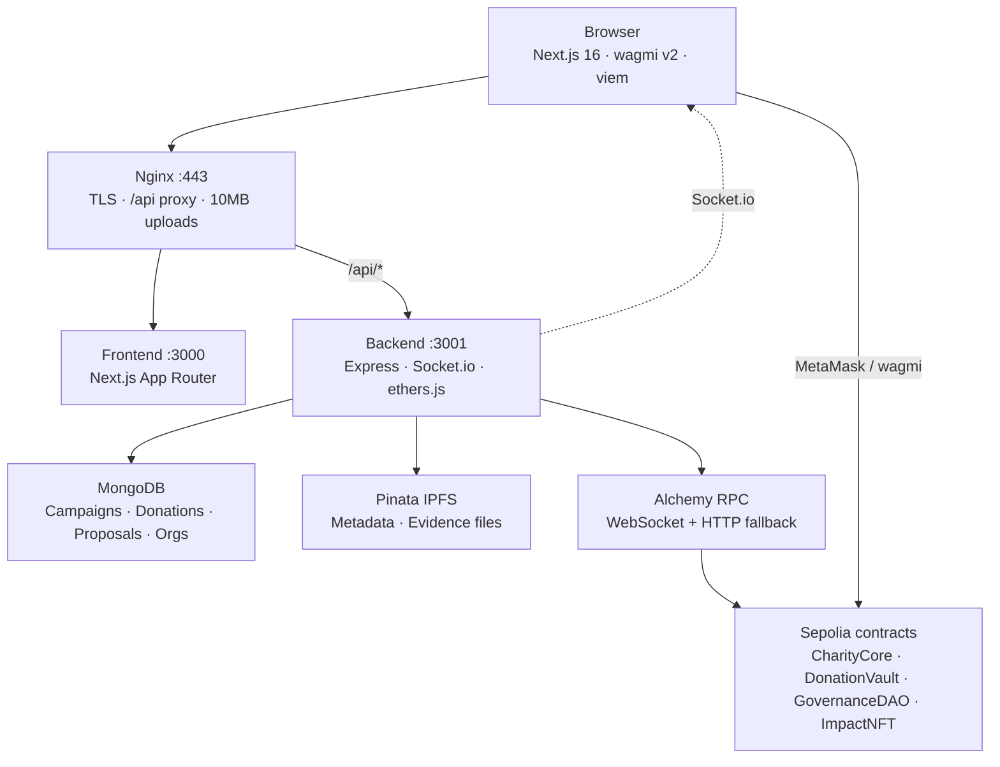

# TranspaChain Architecture

TranspaChain is a full-stack charity platform on **Ethereum Sepolia testnet**. Donations lock in on-chain escrow; milestone releases require donor governance; a backend indexer mirrors chain events into MongoDB for fast UI queries.

**Live:** https://transpachain.site  
**Network:** Sepolia (`chainId` 11155111)

---

## System overview

---

## Component responsibilities

| Layer | Location | Responsibility |
|-------|----------|----------------|
| **Frontend** | `frontend/` submodule | Wallet connect, campaign browse/create, donate (ETH/USDC), governance voting, dashboard, admin UI |
| **Nginx** | `nginx/nginx.conf` | Reverse proxy: `/` → frontend, `/api/` → backend; `client_max_body_size 10m` for evidence uploads |
| **Backend API** | `backend/src/routes/` | REST endpoints for campaigns, donations, proposals, org profiles, evidence, IPFS proxy |
| **Indexer** | `backend/src/indexer/` | Listens to contract events via Alchemy; writes MongoDB; emits Socket.io updates |
| **MongoDB** | Docker volume `mongo_data` | Read-optimized cache of indexed events + off-chain profiles |
| **Smart contracts** | `contracts/` submodule | Escrow, org verification, governance, Impact NFTs |
| **IPFS** | Pinata (via backend) | Campaign metadata JSON and milestone evidence files |

---

## Frontend routes

| Path | Purpose |
|------|---------|
| `/` | Homepage — stats, featured campaigns, live WebSocket updates |
| `/campaigns` | Campaign list with filters |
| `/campaigns/[id]` | Campaign detail — donate, escrow card, org actions, voting |
| `/campaigns/create` | Verified org creates campaign (IPFS metadata + on-chain tx) |
| `/dashboard` | Donor summary, donation history, Impact NFT gallery, org profile form |
| `/governance` | Proposal hub |
| `/governance/[proposalId]` | Vote, queue, execute |
| `/admin` | Verify orgs, review org profiles, approve evidence/proposals (role-gated) |
| `/about` | Mission, anti-abuse policy, founding team carousel |
| `/legal` | Testnet disclaimer, contract addresses, Etherscan links |

UI uses a **dark holo-mint glass theme** (teal/mint accents on black surfaces) — see `frontend/app/globals.css`.

---

## Backend API routes

All routes are prefixed with `/api` at the edge (nginx strips nothing; frontend calls `/api/...`).

| Prefix | Endpoints | Purpose |
|--------|-----------|---------|
| `/health` | GET | Mongo, RPC, indexer sync status |
| `/campaigns` | GET `/`, `/stats`, `/:id`, `/:id/proposals`, `/:id/donations` | Campaign data (scoped by `indexedScope`) |
| `/donations` | GET `/campaign/:id`, `/summary/:address`, `/:address` | Donor and campaign donations |
| `/proposals` | GET `/` | Governance proposal list |
| `/orgs` | GET `/`, `/:address`, POST `/` | Organization profiles |
| `/evidence` | GET `/`, POST `/` | Milestone evidence submissions |
| `/admin` | GET/PATCH org profiles, proposals, evidence; POST reconcile | Admin/verifier workflows |
| `/ipfs` | POST `/metadata`, `/upload`; GET `/:cid` | Pinata proxy |

---

## Data flows

### Donate (ETH or USDC)

1. Donor opens campaign → `DonateModal` calls `DonationVault.donate()` or `donateUSDC()`.
2. Vault locks net amount in escrow; 1% platform fee to treasury.
3. `ImpactNFT` minted (first donation) or tier upgraded (repeat donation).
4. Indexer catches `DonationReceived` → MongoDB `donations` + campaign `raisedAmount`.
5. Socket.io pushes `donationReceived` to homepage listeners.

### Milestone proof → governance → release

1. Org submits proof CID via `DonationVault.submitMilestoneProof()`.
2. GovernanceDAO creates proposal; admin reviews off-chain (`approvalStatus`).
3. Donors vote with **quadratic weight** (√donation) on `/governance/[id]`.
4. After quorum (51% of total voting power) → admin **queues** → 24h timelock → **execute**.
5. `releaseMilestoneFunds` transfers escrow slice to org wallet.

### Refund

1. Campaign finalized as **Failed** (deadline/goal rules) or cancelled (zero donors).
2. Donor calls `claimRefund(campaignId)` — proportional if partial milestones released.
3. Indexer updates donation status; UI shows eligibility via `canRefund`.

### Org onboarding

1. Org submits profile on `/dashboard` → MongoDB `orgprofiles`.
2. Admin reviews in `/admin` → approves profile off-chain.
3. Admin/verifier calls `CharityCore.verifyOrg()` on-chain → `ORG_ROLE`.
4. Org creates campaign at `/campaigns/create`.

See [workflow.md](./workflow.md) for step-by-step flows and [donate-flow.md](./donate-flow.md) for sequence diagrams.

---

## Indexer and `indexedScope`

The backend scopes MongoDB queries to the **current contract deployment**:

- `DEPLOY_FROM_BLOCK` — floor block for backfill and query filters
- `getOnChainTotalCampaigns()` — only campaign IDs `1..totalCampaigns` from live CharityCore
- Orphan rows from prior deploys can be pruned via `POST /admin/reconcile-campaigns`

On startup, if `DEPLOY_FROM_BLOCK > 0`, `historicalSync.ts` backfills events before live subscription. Set `DEPLOY_FROM_BLOCK=0` after sync completes to skip backfill on restart.

Details: [mongodb-guide.md](./mongodb-guide.md), [system-design.md](./system-design.md).

---

## Deployed contracts (Sepolia)

| Contract | Address |
|----------|---------|
| CharityCore | `0xCE017838BfE2785CB2458bb205770663bEB9b0B8` |
| DonationVault | `0xEb421D07E885EeB2B8E9ea408FF284013F872Db1` |
| GovernanceDAO | `0xd655d85ddACc386901487CE8E1ec45BD4F872A19` |
| ImpactNFT | `0xF2556FcccaE36A6d8Da0C75a863CA7368FC6761a` |
| USDC (Sepolia) | `0x1c7D4B196Cb0C7B01d743Fbc6116a902379C7238` |

---

## Environment variables (overview)

| Variable | Used by | Purpose |
|----------|---------|---------|
| `ALCHEMY_SEPOLIA_URL` | Backend | RPC for indexer + health checks |
| `MONGODB_URI` | Backend | Database connection |
| `CHARITY_CORE_ADDRESS` | Backend | Indexer + scope |
| `DONATION_VAULT_ADDRESS` | Backend | Indexer |
| `GOVERNANCE_DAO_ADDRESS` | Backend | Indexer |
| `IMPACT_NFT_ADDRESS` | Backend | Indexer |
| `DEPLOY_FROM_BLOCK` | Backend | Historical backfill + query scope |
| `INDEXER_LOG_CHUNK_SIZE` | Backend | Alchemy free-tier log chunk size (default 10) |
| `PINATA_API_KEY` / `PINATA_SECRET_KEY` | Backend | IPFS pinning |
| `CORS_ORIGIN` | Backend | Allowed frontend origin |
| `NEXT_PUBLIC_ALCHEMY_KEY` | Frontend (build) | Client RPC |
| `NEXT_PUBLIC_*_ADDRESS` | Frontend (build) | Contract addresses baked into JS |
| `NEXT_PUBLIC_USDC_ADDRESS` | Frontend (build) | USDC donate |

Full list: root [`.env.example`](../.env.example). Deploy: [deploy.md](./deploy.md).

---

## Related docs

| Doc | Topic |
|-----|-------|
| [project-report.md](./project-report.md) | Full academic/professional project report |
| [system-design.md](./system-design.md) | Contracts, indexer design, security model |
| [workflow.md](./workflow.md) | End-to-end user workflows |
| [smart-contracts-explained.md](./smart-contracts-explained.md) | Contract FAQ |
| [deploy.md](./deploy.md) | Docker Hub + EC2 deployment |
| [user-manual.md](./user-manual.md) | Platform user guide |
