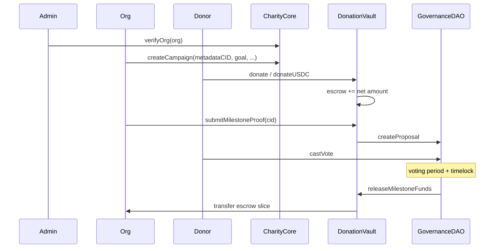

# Charity Business Flow — Off-chain vs On-chain

## Real-world charity lifecycle

1. **Organization onboarding** — NGO proves identity; platform verifies they are legitimate.
2. **Campaign creation** — Org defines goal, deadline, milestones, and metadata (story, images).
3. **Fundraising** — Donors contribute; funds are held until milestones are proven.
4. **Milestone proof** — Org uploads evidence (IPFS) that work was done.
5. **Donor governance** — Donors who contributed vote to approve release.
6. **Fund release** — Escrow pays org per approved milestone.
7. **Failure path** — If goal/deadline not met, donors reclaim remaining escrow.

## TranspaChain mapping

| Real world | On-chain | Off-chain index |
|------------|----------|-----------------|
| Verify NGO | `CharityCore.verifyOrg` → `ORG_ROLE` | `OrgVerified` event → `VerifiedOrg` |
| Create campaign | `CharityCore.createCampaign` (+ deposit) | `CampaignCreated` → `Campaign` + IPFS metadata |
| Donate ETH/USDC | `DonationVault.donate` / `donateUSDC` | `DonationReceived` → `Donation` |
| Impact badge | `ImpactNFT.mintImpactNFT` (once per donor/campaign) | — |
| Submit proof | `DonationVault.submitMilestoneProof` | `MilestoneProofSubmitted` → `Proposal` |
| Vote | `GovernanceDAO.castVote` | `VoteCast` → vote tallies |
| Release funds | `GovernanceDAO.executeProposal` → `releaseMilestoneFunds` | `FundsReleased` |
| Campaign failed | `CharityCore.finalizeCampaign` → Failed | status update |
| Donor refund | `DonationVault.claimRefund` | `RefundProcessed` |

## Roles

| Role | Who | Can do |
|------|-----|--------|
| `DEFAULT_ADMIN_ROLE` / `ADMIN_ROLE` | Deployer / admin wallet | Pause, admin cancel, grant verifier |
| `VERIFIER_ROLE` | Admin or delegated | `verifyOrg` / `revokeOrg` |
| `ORG_ROLE` | Verified org wallet | `createCampaign`, submit proofs (as org) |
| Donor | Any wallet | Donate, vote, claim refund when eligible |

## Trust boundaries

- **Escrow** — DonationVault holds ETH/USDC until DAO releases or donor refunds.
- **Transparency** — All state changes emit events; backend indexes to MongoDB for fast UI.
- **Not a bank** — Sepolia testnet demo; no fiat on-ramp or regulatory licensing implied.
