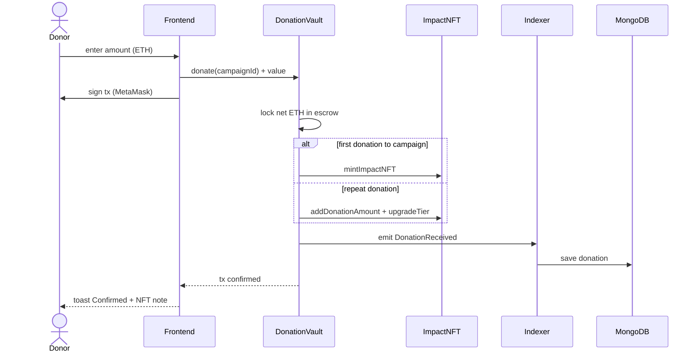
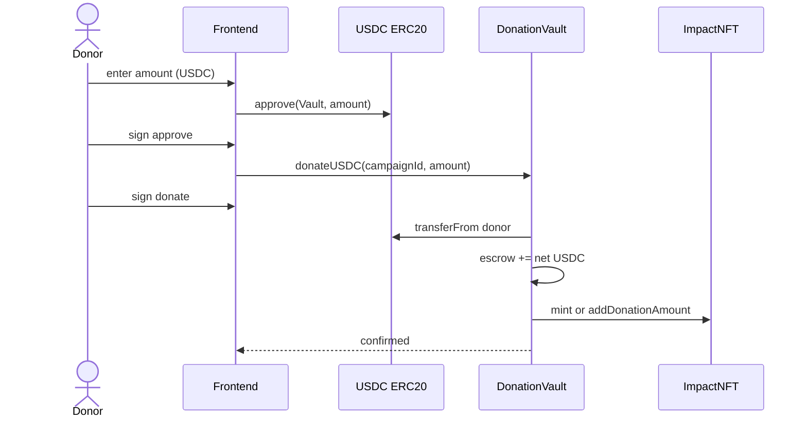
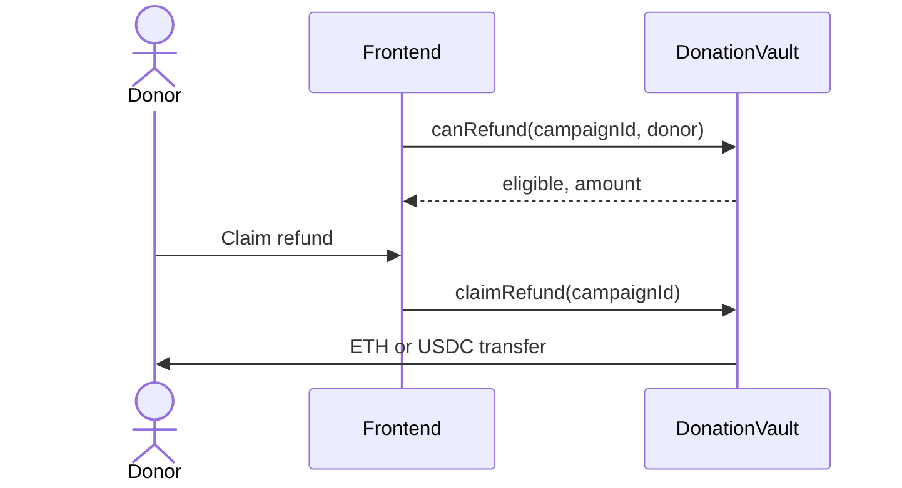

# Donate Flow

## ETH donation

## USDC donation

Requires campaign `paymentToken = USDC` and `NEXT_PUBLIC_USDC_ADDRESS` on frontend.

## Refund flow

Eligible when campaign **Failed** or past **deadline** (see `canRefund`), with proportional adjustment if milestones partially released.
