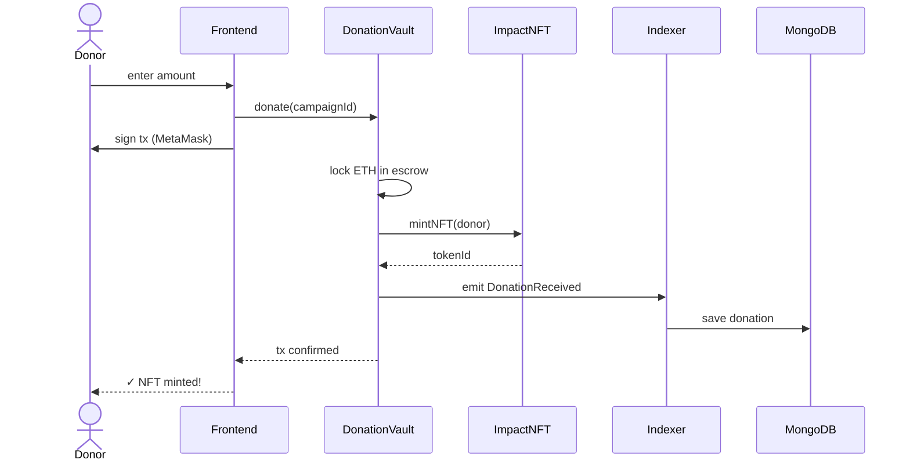

# Donate Flow Sequence Diagram

```mermaid
sequenceDiagram
    actor Donor
    participant Frontend
    participant DonationVault
    participant ImpactNFT
    participant Indexer
    participant MongoDB

    Donor->>Frontend: enter amount
    Frontend->>DonationVault: donate(campaignId)
    Frontend->>Donor: sign tx (MetaMask)
    DonationVault->>DonationVault: lock ETH in escrow
    DonationVault->>ImpactNFT: mintNFT(donor)
    ImpactNFT-->>DonationVault: tokenId
    DonationVault->>Indexer: emit DonationReceived
    Indexer->>MongoDB: save donation
    DonationVault-->>Frontend: tx confirmed
    Frontend-->>Donor: ✓ NFT minted!
```
