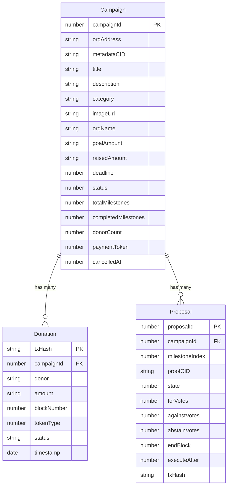

# MongoDB ER Diagram

```mermaid
erDiagram
    Campaign ||--o{ Donation : "has many"
    Campaign ||--o{ Proposal : "has many"

    Campaign {
        number campaignId PK
        string orgAddress
        string metadataCID
        string title
        string description
        string category
        string imageUrl
        string orgName
        string goalAmount
        string raisedAmount
        number deadline
        number status
        number totalMilestones
        number completedMilestones
        number donorCount
        number paymentToken
        number cancelledAt
    }

    Donation {
        string txHash PK
        number campaignId FK
        string donor
        string amount
        number blockNumber
        number tokenType
        string status
        date timestamp
    }

    Proposal {
        number proposalId PK
        number campaignId FK
        number milestoneIndex
        string proofCID
        number state
        number forVotes
        number againstVotes
        number abstainVotes
        number endBlock
        number executeAfter
        string txHash
    }
```
