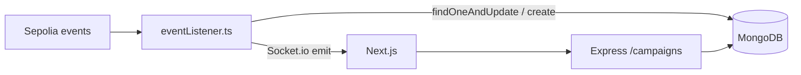

# MongoDB Guide — Where Data Lives & How It Flows

## What MongoDB stores

TranspaChain does **not** replace the blockchain. MongoDB is a **read-optimized cache** of indexed events + IPFS-enriched fields.

| Collection | Source | Purpose |
|------------|--------|---------|
| `campaigns` | `CampaignCreated` + IPFS metadata | List/detail pages, stats |
| `donations` | `DonationReceived` | Donor history, campaign donors |
| `proposals` | `ProposalCreated`, vote/queue events | Governance UI |
| `verifiedorgs` | `OrgVerified` | Admin verified org list |
| `orgprofiles` | POST `/orgs` | Off-chain org applications (admin review) |
| `evidence` | POST `/evidence` | Milestone evidence uploads (admin review) |

See ER diagram: [er-diagram.md](./er-diagram.md).

## Data flow



1. User transacts on-chain (wagmi → MetaMask).
2. `transpachain-backend` indexer listens via Alchemy WebSocket/polling.
3. Handler writes/updates Mongoose documents.
4. Frontend fetches `GET /api/campaigns` (nginx proxies `/api` → backend).

## Current deployment (EC2 Docker)

- Service: `mongodb` in [docker-compose.yml](../docker-compose.yml)
- URI: `mongodb://mongodb:27017/transpachain` (inside compose network)
- Data volume: `mongo_data` on the EC2 host

### View data with MongoDB Compass

**Option A — SSH tunnel**

```bash
ssh -L 27017:localhost:27017 ubuntu@YOUR_EC2_IP
# On EC2, if mongo port is not exposed, use:
# docker exec -it transpachain-mongo mongosh transpachain
```

Connect Compass to `mongodb://localhost:27017/transpachain`.

**Option B — mongosh on server**

```bash
docker exec -it transpachain-mongo mongosh transpachain
db.campaigns.find().pretty()
db.donations.find().limit(5).pretty()
```

**Option C — evidence script (screenshots / portfolio)**

From the monorepo root on EC2 or locally (with Docker mongo running):

```bash
./scripts/mongo-evidence.sh
# production compose explicitly:
COMPOSE_FILE=docker-compose.prod.yml ./scripts/mongo-evidence.sh
```

Prints collection counts, indexes, redacted sample documents, and DB stats in one bannered report.

## MongoDB Atlas (optional, recommended for portfolio)

1. Create free M0 cluster at [mongodb.com/atlas](https://www.mongodb.com/atlas).
2. Allow EC2 IP in Network Access.
3. Set `MONGODB_URI` in EC2 `.env` to Atlas connection string.
4. Restart backend: `docker compose up -d backend`
5. Re-run indexer backfill if needed (`DEPLOY_FROM_BLOCK`).

**Migrate from Docker mongo:**

```bash
docker exec transpachain-mongo mongodump --db transpachain --archive=/tmp/dump.gz --gzip
# copy archive to local, mongorestore to Atlas URI
```

No application code changes — only `MONGODB_URI`.

## Historical sync and `indexedScope`

Set in backend `.env`:

```env
DEPLOY_FROM_BLOCK=11146320
INDEXER_LOG_CHUNK_SIZE=10
```

On startup, indexer backfills events from that block before subscribing to live events. After backfill completes, set `DEPLOY_FROM_BLOCK=0` to skip on restart.

The `indexedScope` module (`backend/src/lib/indexedScope.ts`) filters API queries to the **current deployment**:

- Donations/proposals require `blockNumber >= DEPLOY_FROM_BLOCK` (when set)
- Campaign IDs limited to `1..totalCampaigns()` from live CharityCore
- `/campaigns/stats` donor counts use the same scope

Orphan rows from prior redeploys can be pruned via `POST /api/admin/reconcile-campaigns`.

## Env vars (backend)

| Variable | Role |
|----------|------|
| `MONGODB_URI` | Database connection |
| `ALCHEMY_SEPOLIA_URL` | RPC for indexer |
| `CHARITY_CORE_ADDRESS` | Indexer contract |
| `DEPLOY_FROM_BLOCK` | Optional backfill start |
