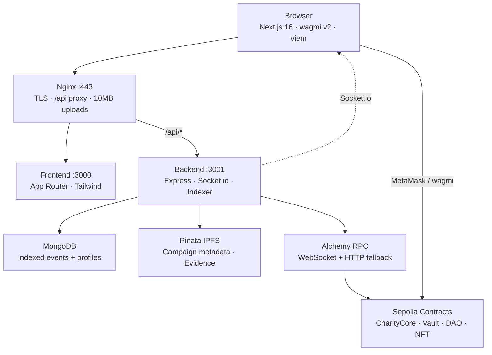

# TranspaChain — Project Report

**Transparent Charity on Blockchain**  
**Version:** 1.0 · **Network:** Ethereum Sepolia Testnet · **Live Demo:** https://transpachain.site

---

## 1. Introduction

### 1.1 Problem Statement

Traditional charity platforms suffer from opacity: donors rarely know how funds are spent, milestone completion is self-reported, and refund mechanisms are slow or absent. Fraud, mismanagement, and loss of donor trust remain persistent challenges in the nonprofit sector.

### 1.2 Proposed Solution

**TranspaChain** is a blockchain-based charity platform that enforces transparency through:

- **On-chain escrow** — donations lock in a smart contract until milestones are approved
- **DAO governance** — donors vote with quadratic weight on milestone release proposals
- **Verifiable organizations** — only admin-verified wallets can create campaigns
- **Impact NFTs** — donors receive tiered ERC-721 badges as proof of contribution
- **Evidence workflow** — organizations upload milestone proof to IPFS; admins review before public voting

This report documents the system architecture, technology choices, workflows, security model, testing, deployment, and limitations of the TranspaChain demonstration platform.

> **Disclaimer:** TranspaChain is deployed on **Sepolia testnet only** for academic and demonstration purposes. Do not send real funds. See [/legal](https://transpachain.site/legal).

---

## 2. Project Overview

### 2.1 Goals

| Goal | Implementation |
|------|----------------|
| Transparent fund flow | DonationVault escrow + on-chain events |
| Donor empowerment | Quadratic voting on GovernanceDAO proposals |
| Org accountability | Milestone proofs + admin evidence review |
| Low-friction UX | Indexed MongoDB cache + real-time Socket.io |
| Portfolio-grade demo | Full Docker deployment on AWS EC2 |

### 2.2 Target Users

| Role | Description | Primary Actions |
|------|-------------|-----------------|
| **Donor** | Individual contributing ETH or USDC | Browse campaigns, donate, vote, claim refunds, collect Impact NFTs |
| **Organization** | Verified nonprofit wallet (`ORG_ROLE`) | Submit org profile, create campaigns, upload milestone evidence, extend deadlines |
| **Admin / Verifier** | Platform operators with on-chain roles | Verify orgs, approve evidence/proposals, queue/execute governance, reconcile indexer |

### 2.3 Repository Structure

TranspaChain is a **monorepo** with three Git submodules:

```
transpachain/                 # Orchestration, docs, Docker, nginx
├── frontend/  → transpachain-frontend
├── backend/   → transpachain-backend
└── contracts/ → transpachain-contracts
```

---

## 3. System Architecture

### 3.1 High-Level Diagram



### 3.2 Component Interaction

1. **Frontend** renders campaign data from the REST API and reads live on-chain state via wagmi/viem (balances, roles, proposal states).
2. **Nginx** terminates TLS, proxies `/` to Next.js and `/api/` to Express, and allows uploads up to 10 MB.
3. **Backend indexer** subscribes to Alchemy for contract events, writes MongoDB documents, and emits Socket.io events.
4. **Pinata** pins campaign metadata JSON and evidence images; the backend proxies uploads to avoid exposing API keys in the browser.
5. **Smart contracts** hold escrowed funds and enforce governance rules; no admin can unilaterally drain donor deposits.

Detailed architecture: [architecture.md](./architecture.md)

---

## 4. Technology Stack Analysis

### 4.1 Frontend

| Technology | Version | Role in TranspaChain |
|------------|---------|----------------------|
| **Next.js** | 16.x | App Router pages for campaigns, governance, dashboard, admin; SSR/SSG hybrid for fast navigation |
| **React** | 18.x | Component model for modals, panels, wallet-gated org actions |
| **TypeScript** | 5.x | Type-safe hooks, API client, contract ABIs |
| **Tailwind CSS** | 3.4 | Dark holo-mint glass UI (`globals.css`) |
| **wagmi** | 2.9 | Wallet connect, `useReadContract`, `useWriteContract` for all on-chain txs |
| **viem** | 2.13 | Low-level encoding, Sepolia chain config, Alchemy transport |
| **@tanstack/react-query** | 5.x | Cached contract reads via wagmi |
| **Socket.io client** | 4.8 | Live homepage stats and donation feed |
| **framer-motion** | 12.x | Page transitions and org action panel animations |
| **@phosphor-icons/react** | 2.x | Consistent iconography across panels |

**Connection pattern:** `lib/wagmi.ts` configures Sepolia; `lib/contracts.ts` loads ABIs and `NEXT_PUBLIC_*` addresses baked at Docker build; `lib/api.ts` calls `/api/*` through nginx.

### 4.2 Backend / API / Indexer

| Technology | Version | Role in TranspaChain |
|------------|---------|----------------------|
| **Node.js + Express** | 4.19 | REST API: campaigns, donations, proposals, orgs, evidence, admin, IPFS |
| **TypeScript** | 5.x | Typed routes, models, indexer handlers |
| **MongoDB + Mongoose** | 8.4 | Indexed chain events + off-chain profiles and evidence |
| **ethers.js** | 6.16 | Event listener, `indexedScope` on-chain reads, health checks |
| **Socket.io** | 4.7 | Real-time `donationReceived`, `campaignUpdated`, `proposalUpdated` |
| **Alchemy** | — | Sepolia RPC/WebSocket for indexer and RPC health rotation |
| **Pinata SDK** | 2.1 | `pinJSONToIPFS` (campaign metadata), `pinFileToIPFS` (evidence images) |
| **multer** | 2.1 | In-memory file buffer for IPFS upload route (max 10 MB) |
| **express-rate-limit** | 8.5 | 120 req/min per IP |

**Indexer modules:** `eventListener.ts` (live subscription), `historicalSync.ts` (backfill from `DEPLOY_FROM_BLOCK`), `indexedScope.ts` (deployment-scoped queries).

### 4.3 Smart Contracts

| Technology | Version | Role in TranspaChain |
|------------|---------|----------------------|
| **Solidity** | 0.8.20 | Four core contracts on Sepolia |
| **Foundry** | — | **307 tests** — unit, fuzz, integration |
| **Hardhat** | 2.22 | Deployment scripts to Sepolia |
| **OpenZeppelin** | 5.6 | AccessControl, ReentrancyGuard, ERC721 |

#### CharityCore
Campaign registry, org verification gate (`ORG_ROLE`), creation deposit, deadline extension, finalize/cancel lifecycle.

#### DonationVault
ETH/USDC escrow per campaign, 1% platform fee, milestone proof submission, refund claims, release only via GovernanceDAO.

#### GovernanceDAO
Quadratic voting (√donation), 51% quorum, 24h timelock, proposal queue/execute by admin.

#### ImpactNFT
ERC-721 donor badges — Bronze/Silver/Gold tiers upgraded on repeat donations.

Contract deep-dive: [smart-contracts-explained.md](./smart-contracts-explained.md)

### 4.4 Database (MongoDB Collections)

| Collection | Source | Purpose |
|------------|--------|---------|
| `campaigns` | `CampaignCreated` + IPFS | List/detail, stats, filters |
| `donations` | `DonationReceived` | Donor history, campaign donors |
| `proposals` | Governance events | Voting UI, approval status |
| `verifiedorgs` | `OrgVerified` / `OrgRevoked` | Admin verified org list |
| `orgprofiles` | POST `/orgs` | Off-chain org applications |
| `evidence` | POST `/evidence` | Milestone image + description (admin review) |

Schema: [er-diagram.md](./er-diagram.md) · Data flow: [mongodb-guide.md](./mongodb-guide.md)

### 4.5 Infrastructure

| Technology | Role in TranspaChain |
|------------|----------------------|
| **Docker + Compose** | `frontend`, `backend`, `mongodb`, `nginx` services on EC2 |
| **Docker Hub** | `cuongnguyen146/transpachain-frontend`, `transpachain-backend` images |
| **Nginx** | TLS (Let's Encrypt), `/api` rewrite proxy, `client_max_body_size 10m` |
| **AWS EC2** | Production host for https://transpachain.site |
| **Sepolia** | Testnet (`chainId` 11155111) — all contract interactions |

Deploy guide: [deploy.md](./deploy.md)

---

## 5. Core Features

### 5.1 Escrow & Milestones
Donations lock in DonationVault. Funds release in equal slices per milestone only after governance approval.

### 5.2 Governance
Org submits on-chain proof CID → GovernanceDAO proposal → admin off-chain approval → donor quadratic vote → queue → 24h timelock → execute → `releaseMilestoneFunds`.

### 5.3 Impact NFTs
First donation mints ERC-721; repeat donations upgrade tier based on cumulative amount (ETH or USDC thresholds).

### 5.4 Verified Organizations
Off-chain profile review + on-chain `verifyOrg()` grants `ORG_ROLE`.

### 5.5 Evidence & IPFS
Orgs upload images via `POST /api/ipfs/upload` (Pinata); metadata stored in `evidence` collection with `approvalStatus: pending` until admin approves.

### 5.6 Refunds
Failed or cancelled campaigns enable proportional `claimRefund` for donors.

---

## 6. Business Workflows

### 6.1 Donor Flow
1. Connect MetaMask (Sepolia) → browse `/campaigns`
2. Donate ETH/USDC on campaign detail → receive Impact NFT
3. Review approved evidence → vote on `/governance/[proposalId]`
4. Claim refund if campaign fails

### 6.2 Organization Flow
1. Submit profile on `/dashboard` → await admin approval
2. Receive `ORG_ROLE` on-chain → create campaign at `/campaigns/create`
3. Upload milestone evidence + on-chain proof CID in Organization actions panel
4. Extend deadline (max 2 platform extensions) or finalize/cancel

### 6.3 Admin Flow
1. Review org profiles and evidence at `/admin`
2. Approve proposals for public voting
3. Queue and execute passed proposals after timelock
4. Run `POST /admin/reconcile-campaigns` after redeploys

Full workflows: [workflow.md](./workflow.md) · [charity-business-flow.md](./charity-business-flow.md)

---

## 7. Security Model

### 7.1 On-Chain Controls

| Control | Mechanism |
|---------|-----------|
| Escrow integrity | Funds exit only via DAO release or donor refund |
| Org gate | `ORG_ROLE` required for `createCampaign` |
| Governance | Quadratic voting + 51% quorum (cast/total power) + majority For + 24h timelock |
| Campaign lifecycle | Funded (goal reached) ≠ Completed; finalize only when expired+underfunded OR all milestones done |
| Refunds | Proportional via `_remainingRefundWeight`; only Failed/Cancelled |
| Reentrancy | `ReentrancyGuard` on DonationVault |
| Spam prevention | Campaign creation deposit |
| Admin limits | Cannot drain escrow; can pause, close proposals, configure fees |

### 7.2 Off-Chain Controls

| Control | Mechanism |
|---------|-----------|
| Evidence review | Admin approves before donors vote |
| API abuse | Rate limiting, CORS to `CORS_ORIGIN` |
| Data integrity | `indexedScope` + reconcile jobs |
| IPFS keys | Pinata credentials server-side only |

Audit notes: [security-audit.md](./security-audit.md)

---

## 8. Testing

### 8.1 Smart Contract Tests (Foundry)

```bash
make contracts-test   # from monorepo root
```

| Suite | Tests |
|-------|-------|
| CharityCoreTest | 19 |
| DonationVaultTest | 82 |
| ImpactNFTTest | 43 |
| GovernanceDAOTest | 73 |
| TranspaChainTest (integration) | 50 |
| DonationVaultFuzz (×2) | 40 |
| **Total** | **307 passed** |

Coverage includes donation lifecycle, refunds, governance quorum/timelock, NFT tiers, fuzz invariants, and cross-contract integration.

### 8.2 Integration
- Backend indexer sync verified via `GET /health` (`onChainCampaigns === indexedCampaigns`)
- Frontend `npm run build` validates TypeScript and Next.js compilation
- Manual demo checklist: [demo-guide.md](./demo-guide.md)

---

## 9. Deployment

### 9.1 Production Stack (EC2)

1. Clone monorepo with submodules
2. Configure root `.env` from `.env.example`
3. Build frontend on WSL: `make docker-build-frontend`
4. Push images to Docker Hub
5. EC2: `docker compose pull && docker compose up -d`

### 9.2 Contract Addresses (Sepolia)

| Contract | Address |
|----------|---------|
| CharityCore | `0x8a5e023b16ab13939260492dAe72a0be1E597e1a` |
| DonationVault | `0x68Bb9f5E1414b1a62372EbF02fdEe4c09fFc7C32` |
| GovernanceDAO | `0xCcAEaF248E536850877B9f948cB237Fe7885b513` |
| ImpactNFT | `0xD651d3531a44ee7941bFE257c79F41d274E180A6` |
| USDC (Sepolia) | `0x1c7D4B196Cb0C7B01d743Fbc6116a902379C7238` |

Details: [deploy.md](./deploy.md)

---

## 10. Limitations & Future Work

| Limitation | Notes |
|------------|-------|
| Sepolia only | No mainnet deployment; test ETH/USDC only |
| Demo scope | Not audited for production use |
| Indexer lag | MongoDB may trail chain during RPC outages |
| Org extension count | Frontend tracks 2 extensions in localStorage (UX policy) |
| IPFS dependency | Upload requires Pinata API keys on backend |

**Future work:** Mainnet pilot, multisig admin, ZK identity for orgs, mobile wallet support, subgraph alternative to custom indexer, additional stablecoins.

---

## 11. Conclusion

TranspaChain demonstrates how blockchain escrow, DAO governance, and transparent evidence workflows can address trust deficits in charitable giving. The platform combines Solidity smart contracts (307 Foundry tests), a real-time Node.js indexer, and a modern Next.js frontend into a deployable Docker stack on Sepolia testnet.

While scoped as a demonstration project, TranspaChain provides a complete reference architecture for milestone-based charity funding with donor oversight — a model applicable to real-world nonprofit transparency initiatives once extended beyond testnet.

---

## References

| Document | Topic |
|----------|-------|
| [architecture.md](./architecture.md) | System overview and data flows |
| [system-design.md](./system-design.md) | Contracts, indexer, security |
| [user-manual.md](./user-manual.md) | End-user guide |
| [deploy.md](./deploy.md) | Production deployment |
| [security-audit.md](./security-audit.md) | Security analysis |
