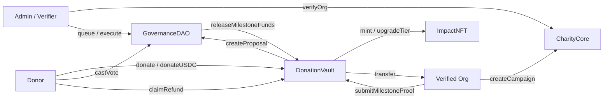

# TranspaChain System Design

Technical design reference for smart contracts, backend indexer, frontend Web3 integration, and security model. For high-level architecture see [architecture.md](./architecture.md). For the full project report see [project-report.md](./project-report.md).

---

## Smart contract architecture

Four core contracts deployed as a linked system on Sepolia:



### CharityCore

- Campaign registry: `createCampaign`, status lifecycle (`Active`, `Successful`, `Failed`, `Cancelled`)
- Org gate: only `ORG_ROLE` wallets (granted after `verifyOrg`) can create campaigns
- Creation deposit discourages spam campaigns
- `finalizeCampaign`, `extendDeadline`, `cancelCampaign` — org/admin lifecycle controls
- Roles: `DEFAULT_ADMIN_ROLE`, `ADMIN_ROLE`, `VERIFIER_ROLE`, `ORG_ROLE`

### DonationVault

- Escrow per `campaignId` for ETH and USDC
- `donate` / `donateUSDC` — 1% platform fee (max 5%) to treasury at deposit time
- Per-donor balances tracked for refunds and voting power lookup
- `submitMilestoneProof(proofCID)` — creates GovernanceDAO proposal
- `releaseMilestoneFunds` — **only callable by GovernanceDAO**
- `claimRefund` — pull-pattern refunds when campaign failed or deadline passed
- `ReentrancyGuard` on all value transfers

### GovernanceDAO

- Proposals created exclusively by DonationVault on milestone proof submission
- **Quadratic voting:** weight = `sqrt(donation amount)` — Sybil-resistant vs linear stake
- **Quorum:** 51% of total quadratic voting power for the campaign
- States: `Pending` → `Active` → `Queued` → `Executed` or `Defeated`
- **Timelock:** 24 hours after queue before execute
- Admin can `closeProposal` for abusive submissions
- Off-chain **admin approval gate:** proposals with `approvalStatus != approved` hidden from public vote UI until admin approves evidence

### ImpactNFT

- ERC-721 badge — one token per donor per campaign (first donation mints)
- Tiers: Bronze / Silver / Gold based on cumulative donation
  - ETH: &lt; 0.01 / ≥ 0.01 / ≥ 0.1 ETH
  - USDC: &lt; 25 / ≥ 25 / ≥ 250 USDC
- Repeat donations call `addDonationAmount` + `upgradeTier` on-chain
- Transferable ERC-721 (testnet souvenir, not an investment product)

Contract deep-dive: [smart-contracts-explained.md](./smart-contracts-explained.md)

---

## Backend design

### Indexer (`eventListener.ts` + `historicalSync.ts`)

| Event source | MongoDB collection | Key fields |
|--------------|-------------------|------------|
| `CampaignCreated` | `campaigns` | title, goal, metadata from IPFS |
| `DonationReceived` | `donations` | donor, amount, tokenType, blockNumber |
| `ProposalCreated`, votes, queue, execute | `proposals` | state, votes, proofCID |
| `OrgVerified` / `OrgRevoked` | `verifiedorgs` | address, blockNumber |
| Status / deadline events | `campaigns` | status, raisedAmount updates |

**RPC resilience:** `rpcProvider.ts` rotates Alchemy HTTP endpoints on failure.

**Real-time:** Socket.io emits `campaignUpdated`, `donationReceived`, `proposalUpdated`, etc.

### `indexedScope` module

Prevents stale data from prior contract redeploys polluting stats and lists:

```typescript
// Simplified logic
deploymentDonationFilter(totalCampaigns) = {
  blockNumber: { $gte: DEPLOY_FROM_BLOCK },  // when > 0
  campaignId: { $gte: 1, $lte: totalCampaigns }
}
```

Applied in: `/campaigns`, `/campaigns/stats`, `/donations/*`, `/proposals`, `/admin/*`, `/evidence`.

Admin reconcile endpoints prune orphan rows outside deployment scope.

### Off-chain models (not on-chain)

| Model | Purpose |
|-------|---------|
| `OrgProfile` | KYC-style application before on-chain verify |
| `Evidence` | Milestone evidence upload metadata; admin review workflow |
| Proposal `approvalStatus` | Gate before donors see proposal in governance hub |

### API middleware

- CORS locked to `CORS_ORIGIN`
- Rate limit: 120 req/min per IP
- Centralized `errorHandler` for consistent JSON errors
- `/health` reports mongo, RPC, indexer sync (`onChainCampaigns === indexedCampaigns`)

Schema reference: [er-diagram.md](./er-diagram.md), [mongodb-guide.md](./mongodb-guide.md).

---

## Frontend Web3 integration

| Concern | Implementation |
|---------|----------------|
| Wallet | wagmi v2 + viem; MetaMask primary |
| Config | `lib/wagmi.ts` — Sepolia chain, Alchemy transport |
| Contracts | `lib/contracts.ts` — ABIs + addresses from `NEXT_PUBLIC_*` env |
| Hooks | `hooks/useCharityCore.ts`, `useDonationVault.ts`, `useGovernance.ts` |
| API client | `lib/api.ts` — fetches `/api/*` via nginx proxy |
| Live updates | `hooks/useSocket.ts` — Socket.io on homepage and admin |
| IPFS | Backend proxy (`/api/ipfs/upload`) — org evidence and campaign images; Pinata keys server-side only |

**Evidence upload flow:** Org selects image via `FileUploadButton` → `POST /api/ipfs/upload` (multer + Pinata) → `POST /api/evidence` with `imageUrl` + `ipfsCID` → admin approves at `/admin` → donors vote after proposal approval.

**Build-time env:** All `NEXT_PUBLIC_*` values are baked into the Docker frontend image at build. Changing contract addresses requires rebuilding and redeploying the frontend image.

---

## Security model

### On-chain

| Control | Mechanism |
|---------|-----------|
| Escrow integrity | Funds leave vault only via DAO release or donor refund |
| Org gate | `ORG_ROLE` required to create campaigns |
| Governance integrity | Quadratic voting + quorum + timelock |
| Reentrancy | `ReentrancyGuard` on DonationVault |
| Admin powers | Pause, fee config, proposal close — **cannot drain escrow** |
| Spam prevention | Campaign creation deposit |

### Off-chain

| Control | Mechanism |
|---------|-----------|
| Evidence review | Admin approves proposals before public vote |
| Org onboarding | Off-chain profile review + on-chain verify |
| API abuse | Rate limiting, CORS |
| Data integrity | `indexedScope` + reconcile jobs |

### Roles summary

| Role | Capability |
|------|------------|
| Donor | Donate, vote, claim refund |
| Verified org (`ORG_ROLE`) | Create campaign, submit milestone proof, extend/cancel/finalize |
| Verifier (`VERIFIER_ROLE`) | `verifyOrg` / `revokeOrg` |
| Admin (`ADMIN_ROLE`) | Queue/execute proposals, close proposals, admin cancel |
| Deployer | Grant roles, pause contracts |

Full audit notes: [security-audit.md](./security-audit.md)

---

## Test coverage

Run from monorepo root:

```bash
make contracts-test   # forge test in contracts submodule
```

Current suite: **307 Foundry tests** (unit + fuzz + integration).
