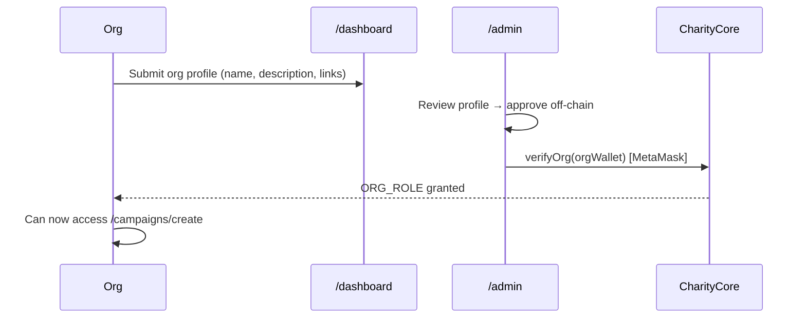

# TranspaChain Workflows

End-to-end workflows for organizations, donors, admins, and verifiers. Maps real-world charity steps to on-chain and off-chain actions.

For business context see [charity-business-flow.md](./charity-business-flow.md). For sequence diagrams see [donate-flow.md](./donate-flow.md).

---

## 1. Organization onboarding



| Step | Actor | Action | Where |
|------|-------|--------|-------|
| 1 | Org | Fill organization profile form | `/dashboard` |
| 2 | Admin | Review pending profiles | `/admin` → Org Profiles tab |
| 3 | Admin/Verifier | Approve profile off-chain | PATCH `/api/admin/org-profiles/:address` |
| 4 | Admin/Verifier | Call `verifyOrg(wallet)` on-chain | `/admin` → Verify Org |
| 5 | Indexer | Index `OrgVerified` event | MongoDB `verifiedorgs` |

Org cannot create campaigns until step 4 completes.

---

## 2. Campaign creation

| Step | Actor | Action |
|------|-------|--------|
| 1 | Org | Connect verified wallet at `/campaigns/create` |
| 2 | Org | Upload cover image + fill title, description, goal, deadline, milestones |
| 3 | Frontend | POST metadata JSON to `/api/ipfs/metadata` → receive CID |
| 4 | Org | Sign `CharityCore.createCampaign(metadataCID, goal, deadline, milestones, paymentToken)` |
| 5 | Indexer | Fetch IPFS metadata → create `campaigns` document |
| 6 | Public | Campaign appears on `/` and `/campaigns` |

**Payment token:** ETH (native) or USDC (`paymentToken` set at creation). USDC campaigns require donors to approve USDC before donating.

---

## 3. Donate (donor path)

| Step | Actor | Action |
|------|-------|--------|
| 1 | Donor | Browse `/campaigns` → open campaign detail |
| 2 | Donor | Review Escrow Vault card (locked funds, milestones remaining) |
| 3 | Donor | Open Donate modal → enter amount (ETH or USDC) |
| 4 | Donor | Sign transaction(s): USDC needs `approve` then `donateUSDC` |
| 5 | Contract | Net amount locked in DonationVault; 1% fee to treasury |
| 6 | Contract | ImpactNFT minted (first time) or tier upgraded |
| 7 | Donor | View badge in `/dashboard` NFT gallery |

Voting power for governance = √(total donated amount) for that campaign.

---

## 4. Milestone evidence and admin review

| Step | Actor | Action |
|------|-------|--------|
| 1 | Org | Complete milestone work off-chain |
| 2 | Org | Upload evidence file → `/api/ipfs/upload` → CID |
| 3 | Org | Submit proof on campaign page (Organization actions) |
| 4 | Contract | `submitMilestoneProof` → GovernanceDAO creates proposal |
| 5 | Admin | Review evidence in `/admin` → approve or reject |
| 6 | Public | Approved proposals appear on `/governance` |

Until admin approves, donors do not see the proposal for voting (off-chain gate on `approvalStatus`).

---

## 5. Governance vote → release

| Step | Actor | Action |
|------|-------|--------|
| 1 | Donor | Open `/governance/[proposalId]` |
| 2 | Donor | Cast vote For / Against / Abstain (quadratic weight) |
| 3 | System | Wait for voting period (~3 days block-based) |
| 4 | Admin | Queue proposal if passed (51% quorum of cast votes + majority For) |
| 5 | System | 24-hour timelock |
| 6 | Admin | Execute release → `releaseMilestoneFunds(campaignId, idx, proposalId)` |
| 7 | Vault | Escrow slice transferred to org wallet |
| 8 | UI | Milestone timeline shows **Released** |

**Defeated vote:** Proposal fails; escrow unchanged. Org resubmits proof via `submitMilestoneProof` (DAO `resubmitProposal` is disabled).

**Campaign phases:** Active → Funded (goal reached) → Milestone voting → Completed (all milestones released). **Funded ≠ Completed.**

---

## 6. Campaign failure and refund

| Step | Actor | Action |
|------|-------|--------|
| 1 | Anyone | After deadline with goal not met, call `finalizeCampaign` → **Failed** |
| 1b | Anyone | After all milestones released, call `finalizeCampaign` → **Successful/Completed** |
| 2 | Donor | **Claim refund** only when Failed/Cancelled and `getRefundableAmount > 0` |
| 3 | Donor | Sign `claimRefund(campaignId)` — proportional share of remaining escrow |
| 4 | Vault | Uses `_remainingRefundWeight` for fair proportional refunds |

**Cancel path:** Org can cancel only with zero milestones released; admin can cancel after partial release (proportional refund).

---

## 7. Impact NFT upgrade

| Step | Trigger | Result |
|------|---------|--------|
| First donation | `mintImpactNFT` | Bronze tier (default) |
| Repeat donation | `addDonationAmount` + `upgradeTier` | Tier may upgrade to Silver or Gold |
| View | `/dashboard` | NFT gallery with tier badge |

Tiers are cumulative per campaign — one NFT per donor per campaign.

---

## 8. Admin / verifier flows

### Verify organization

1. Connect wallet with `ADMIN_ROLE` or `VERIFIER_ROLE`.
2. Navigate to `/admin` (tab visible only when role detected).
3. Review org profile → approve off-chain.
4. Enter org wallet address → **Verify on-chain** (`verifyOrg`).
5. Optionally **Revoke** (`revokeOrg`) if org becomes untrusted.

### Review milestone evidence

1. `/admin` → Pending Proposals or Evidence tab.
2. Inspect IPFS proof link or uploaded file.
3. Approve → proposal visible on `/governance`.
4. Reject or close with reason → donors not exposed to bad proof.

### Reconcile indexer

If stats look stale after redeploy:

```bash
curl -X POST https://transpachain.site/api/admin/reconcile-campaigns
curl -X POST https://transpachain.site/api/admin/reconcile-verified-orgs
```

Requires appropriate deployment access (internal/admin tooling).

---

## 9. Dashboard sections (donor)

| Section | Content |
|---------|---------|
| Stats cards | ETH/USDC donated, campaigns supported, milestones released |
| Donation history | Tx links to Sepolia Etherscan |
| Impact NFT gallery | Tier badges per campaign |
| Org profile form | For org wallets — submit onboarding application |
| Notifications | Active proposals needing your vote |

---

## 10. Governance hub

| Element | Meaning |
|---------|---------|
| Proposal list | All indexed proposals with state badges |
| Quadratic weight | √(your donation) shown when connected |
| Vote buttons | For / Against / Abstain — requires donor wallet |
| Queue / Execute | Admin-only after vote passes + timelock |
| Timelock countdown | 24h after queue before execute enabled |

---

## Quick reference: who can do what

| Action | Donor | Verified org | Admin | Verifier |
|--------|-------|--------------|-------|----------|
| Donate | ✓ | ✓ | ✓ | ✓ |
| Vote on proposals | ✓ (if donated) | — | — | — |
| Create campaign | — | ✓ | — | — |
| Submit milestone proof | — | ✓ | — | — |
| Verify org on-chain | — | — | ✓ | ✓ |
| Approve evidence (off-chain) | — | — | ✓ | ✓ |
| Queue / execute proposal | — | — | ✓ | — |
| Claim refund | ✓ (when eligible) | — | — | — |
